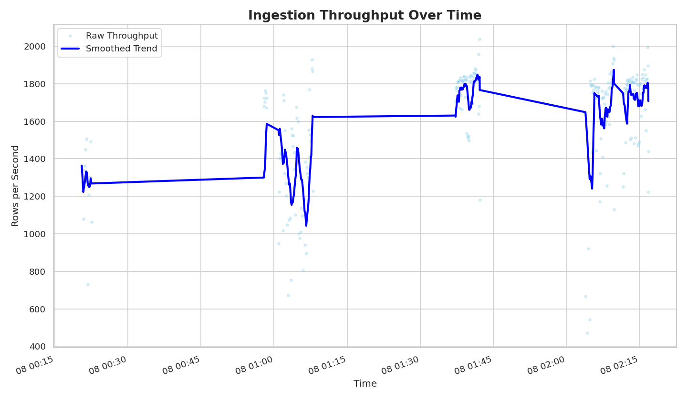
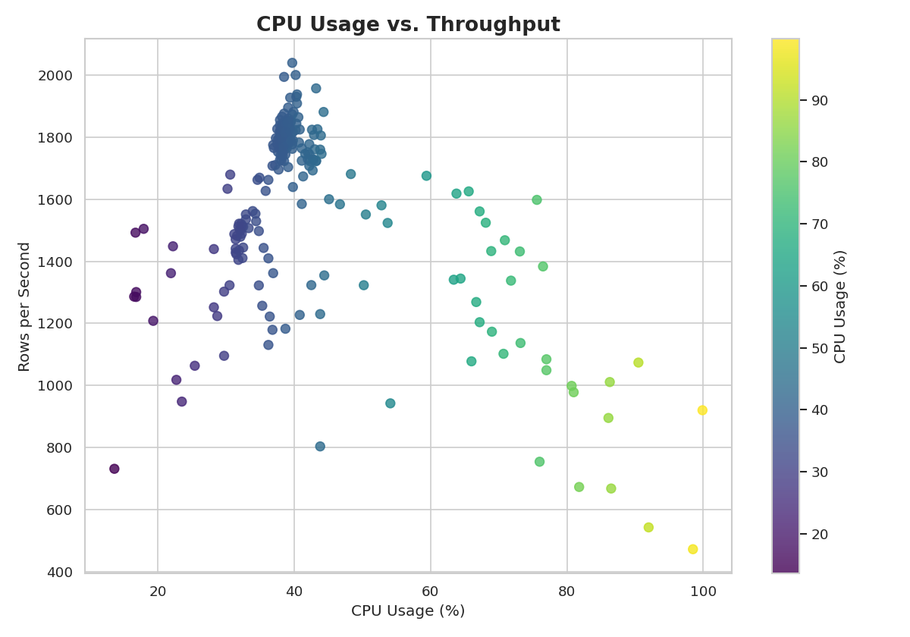
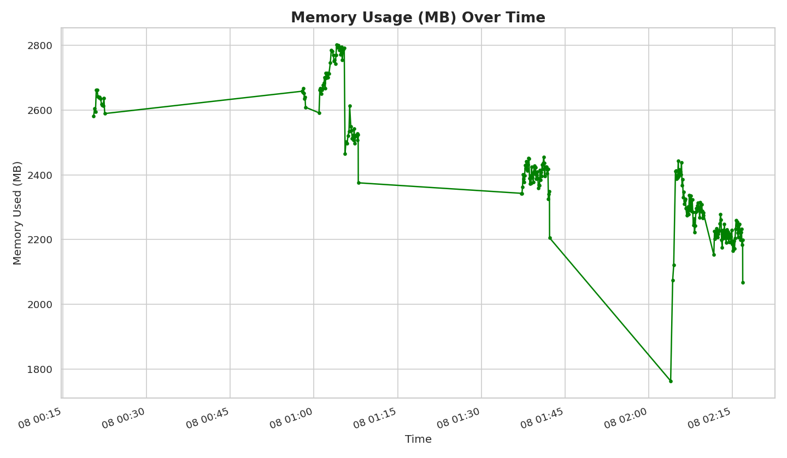
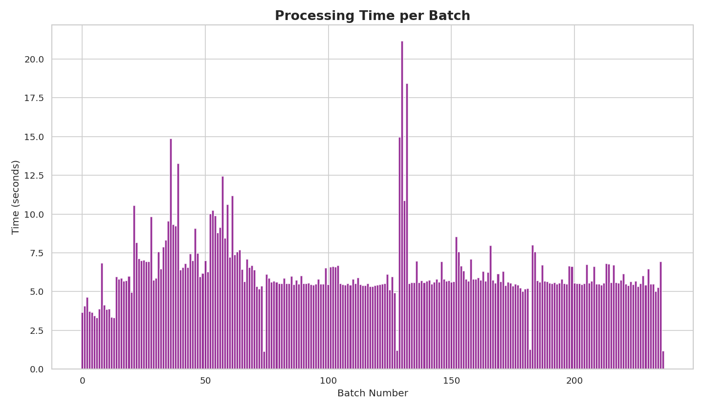

# Neythaleon

**Neythaleon** is an efficient, dependency-light data ingestion and observability toolkit for marine biodiversity datasets. Originally built for IndOBIS datasets, it ingests `.parquet` files, performs a robust cleaning pipeline, streams the data to PostgreSQL, and tracks detailed system metrics.

> _"The Eye Below Logs Everything."_

---

## Features

- 🐠 **Efficient Ingestion:** Ingests large `.parquet` files in memory-safe chunks using DuckDB.
- ⚙️ **Robust ETL:** A multi-step cleaning and transformation pipeline handles data types, special characters, and complex geometry formats.
- 🐘 **High-Performance Loading:** Uses PostgreSQL's native `COPY` command for fast, bulk data insertion.
- 📈 **Comprehensive Observability:** Logs detailed performance metrics, including CPU, RAM, throughput, and processing time per batch.
- 🛡️ **Schema Safe:** Automatically synchronizes the data's structure with the database table schema to prevent load failures.
- 📦 **Automated Setup:** Can automatically create the target database table if it doesn't exist.

---

## 🧠 Architecture

1.  **Extract:** Read `.parquet` files in memory-efficient chunks using DuckDB.
2.  **Transform:** A pipeline of cleaning functions is applied to each chunk:
    * Drop sparse columns and rows without valid coordinates.
    * Enforce correct integer data types.
    * Sanitize text fields by removing special characters.
    * Convert binary geometry (WKB) to text (WKT).
3.  **Align:** The schema of the cleaned data is dynamically matched to the target database table's schema.
4.  **Load:** The prepared data is bulk-loaded into PostgreSQL via an in-memory TSV stream.
5.  **Log:**
    * Time taken, CPU %, and RAM % are recorded for each chunk.
    * Rows ingested and processing speed (rows/sec) are calculated.
    * Metrics are exported to `metrics_log.csv` and human-readable logs.

---

## 📊 Sample Visualizations

> These visualizations are generated from the `metrics_log.csv` file, providing a clear view of the pipeline's performance under load.
> Run `python plot.py` to generate these visuals in the `media/` directory.

### ⏱️ Ingestion Throughput

Shows rows ingested per second, with a rolling average to highlight performance stability and trends over the entire run.

### 🧠 CPU vs. Throughput

This scatter plot reveals how CPU load correlates with ingestion speed, helping to identify performance sweet spots and bottlenecks.

### 💾 Memory Usage

Tracks memory consumption over time, verifying the stability and efficiency of the streaming process.

### ⏳ Batch Processing Time

A bar chart showing the time taken to process each individual batch, making it easy to spot outliers and inconsistent performance.

---

## 📁 File Structure

```bash
.
├── ingest.py              # Main pipeline script
├── plot.py                # Generates performance dashboards
├── metrics_log.csv        # System + ingestion metrics (autogenerated)
├── ingestion.log          # Step-by-step logs (autogenerated)
├── .env                   # Database credentials (e.g., DATABASE_URL)
├── requirements.txt       
└── parquet_files/         # Directory for source .parquet files
```
---
## 🔧 Requirements
- Python 3.8+

- DuckDB

- Pandas

- SQLAlchemy

- Shapely

- Psycopg2 (or other DB driver)

- A PostgreSQL-compatible database

### Install via:
```bash
pip install -r requirements.txt
```

---

## 🐙 Dataset
This project uses records from OBIS - the Ocean Biodiversity Information System. The data represents a full dump from July 2025. Neythaleon is designed to handle the raw complexity of this data, performing the necessary preprocessing to make it database-ready.

### Source:
OBIS Data Portal (July 2025)

### **Citation**:

OBIS (2025). Global distribution records from the OBIS database.
Ocean Biodiversity Information System. Intergovernmental Oceanographic Commission of UNESCO.

Available at: [OBIS](https://obis.org/data/access/).

---

## ❄️ Why This Matters

Building observable and reproducible data pipelines is fundamental to reliable data science. This project serves as a real-world example of analyzing and optimizing a Python ETL script, demonstrating how to identify and resolve complex performance bottlenecks through iterative testing and analysis.

---

## 🪪 License
- Code: MIT

- Data: CC0 1.0 

--- 
 
## ⚓ Quote That Hit Different
> "The sea, once it casts its spell, holds one in its net of wonder forever."
   — Jacques Cousteau
---