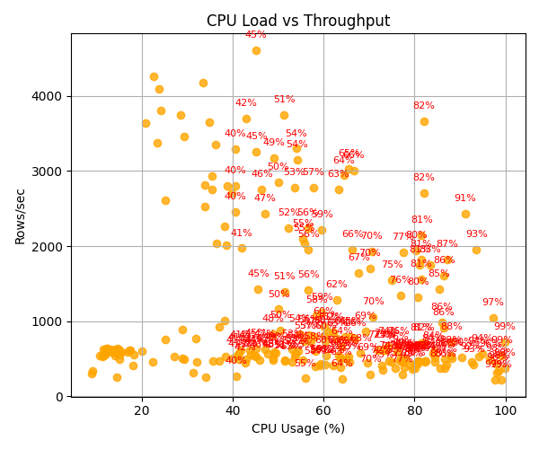
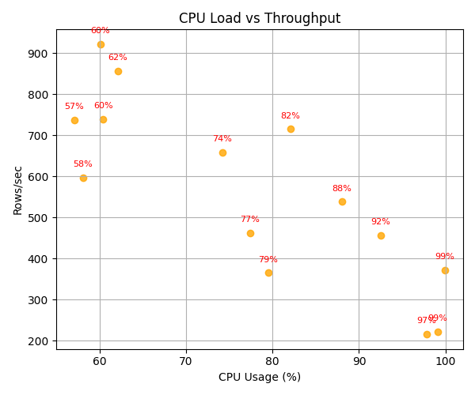

# Neythaleon

**Neythaleon** is a low-footprint ingestion + observability toolkit for marine biodiversity data, designed for edge environments with limited compute. Originally built for IndOBIS datasets (Kochi region -> global OBIS), it ingests `.parquet`, cleans, streams to Postgres, and tracks system metrics all without frameworks.

> _"The Eye Below Logs Everything."_

---

## Features

- 🐡 Ingest `.parquet` files using DuckDB (streamed, chunked)
- 🪝 Fallback: row-by-row retry on batch failure
- 🧪 Logs CPU, RAM, throughput, and ingestion speed
- 🔍 Coordinate validation + null column dropping
- 🗺️ Basic plots with Folium and Matplotlib
- 🪶 Lightweight: no frameworks, minimal RAM, runs offline

---

## 🧠 Architecture

1. Read `.parquet` in chunks (DuckDB)
2. Preprocess: drop empty columns, validate lat/lon
3. Insert into Postgres via SQLAlchemy
4. Fallback to per-row insert if bulk insert fails
5. Log:
   - Time taken per chunk
   - CPU %, RAM %
   - Rows ingested, rows failed
6. Export metrics to `metrics_log.csv` and human-readable `.log`

---

## 📊 Sample Visualizations

> Real-time ingestion performance captured by Neythaleon's metrics logger.

> Run `python plot_metrics_1.py` and `python plot_metrics_2.py` to generate these visuals

### ⏱️ Ingestion Throughput Over Time



This graph shows rows ingested per second over time, with a rolling average to highlight ingestion stability.

### 🧠 CPU Usage vs Throughput


This scatter plot reveals how CPU load correlates with ingestion throughput. Outliers are annotated for clarity.

---

## 📁 File Structure

```bash
.
├── ingest.py              # Main pipeline script
├── metrics_log.csv        # System + ingestion metrics (autogenerated)
├── ingestion.log          # Step-by-step logs (autogenerated)
├── .env                   # Postgres creds
├── requirements.txt       
└── parquet_files/         # Raw data directory
```

## 🔧 Requirements
- Python 3.8+

- DuckDB

- Pandas

- SQLAlchemy

- A PostgreSQL instance (NeonDB compatible)

### Install via:
```bash
pip install -r requirements.txt
```
##### Use --debug for verbose logs
---

## 🐙 Dataset
This project uses .parquet records from OBIS — the Ocean Biodiversity Information System. Data was downloaded as a full dump in July 2025, unfiltered by region or taxonomy. Neythaleon performs light preprocessing only: dropping null columns and removing invalid coordinates.

### Source:
OBIS Data Portal (July 2025)

### **Citation**:

OBIS (2025). Global distribution records from the OBIS database.
Ocean Biodiversity Information System. Intergovernmental Oceanographic Commission of UNESCO.

Available at: [OBIS](https://obis.org/data/access/).

---

## ❄️ Why This Matters

- This pipeline is built for real-world marine fieldwork:

- No cloud access

- Spotty compute

- NSF audits incoming

- You need something that runs here, not out there

---

## 🪪 License
- Code: MIT

- Data: CC0 1.0 

--- 
 
## ⚓ Quote That Hit Different
> This is what real edge computing looks like.
   No cloud. No cluster. Just flaky CPUs on ocean laptops, trying to survive the deep sea and NSF reporting requirements.
---