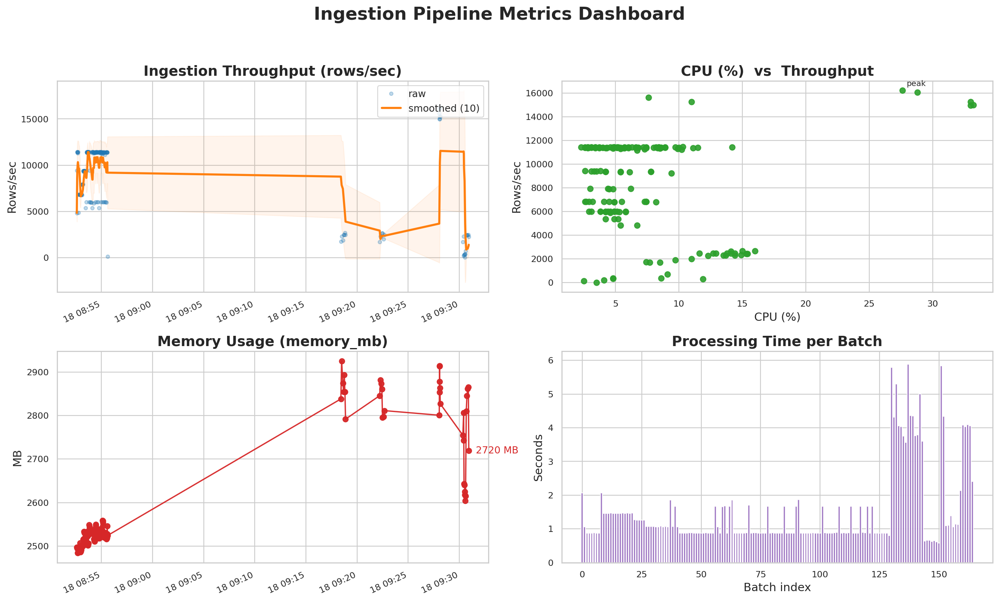
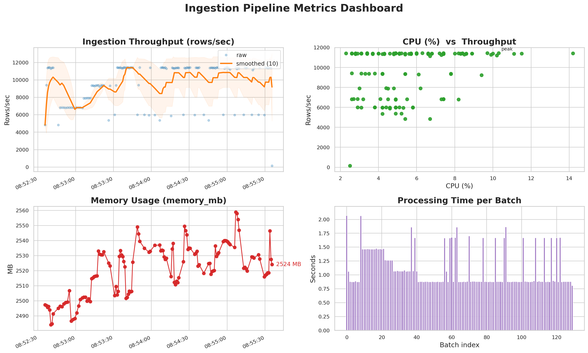
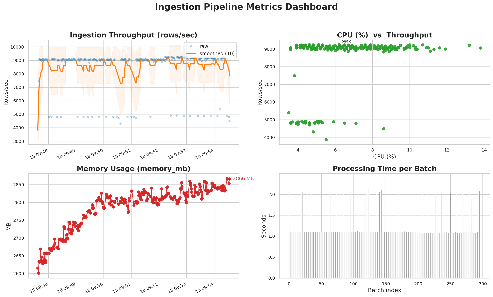

# Neythaleon

## Features

- **Efficient Ingestion:** Ingests large `.parquet` files in memory-safe chunks using DuckDB.
- **Robust ETL:** A multi-step cleaning and transformation pipeline handles data types, special characters, and complex geometry formats.
- **High-Performance Loading:** Uses PostgreSQL's native `COPY` command for fast, bulk data insertion.
- **Comprehensive Observability:** Logs detailed performance metrics, including CPU, RAM, throughput, and processing time per batch.
- **Schema Safe:** Automatically synchronizes the data's structure with the database table schema to prevent load failures.
- **Automated Setup:** Can automatically create the target database table if it doesn't exist.

---

## 🧠 Architecture

1.  **Extract:** Read `.parquet` files in memory-efficient chunks using DuckDB.
2.  **Transform:** A pipeline of cleaning functions is applied to each chunk:
    * Drop sparse columns and rows without valid coordinates.
    * Enforce correct integer data types.
    * Sanitize text fields by removing special characters.
    * Convert binary geometry (WKB) to text (WKT).
3.  **Align:** The schema of the cleaned data is dynamically matched to the target database table's schema.
4.  **Load:** The prepared data is bulk-loaded into PostgreSQL via an in-memory TSV stream.
5.  **Log:**
    * Time taken, CPU %, and RAM % are recorded for each chunk.
    * Rows ingested and processing speed (rows/sec) are calculated.
    * Metrics are exported to `metrics_log.csv` and human-readable logs.

---

## 📊 Sample Visualizations

> These dashboards are generated from the `metrics_log.csv` file using `plot.py`, providing a clear view of the pipeline's performance across different datasets and schemas.

### 1. OBIS Data (Baseline Performance)

*The baseline run on biodiversity data shows a highly stable throughput of over **11,000 rows/sec** with very low CPU usage, indicating an I/O-bound and efficient process.*

---
### 2. NYC For-Hire Vehicle (FHV) Data

*This test on the FHV dataset demonstrates the pipeline's consistency, achieving a stable throughput of **~9,000 rows/sec** with remarkably uniform batch processing times.*

---
### 3. NYC Yellow Taxi Data

*This run on the larger NYC Yellow Taxi dataset shows the pipeline's ramp-up behavior, peaking at **~2,700 rows/sec** and highlighting a positive correlation between CPU usage and throughput.*

---

## 📁 File Structure

```bash
.
Neythaleon/                           # repo root
├─ .env.examples                      # runtime config (DATABASE_URL, PARQUET_DIR, etc.)
├─ main.py                            # top-level runner (calls ingest CLI then plot CLI)
├─ requirements.txt                   # pinned/loose deps
├─ README.md                          # (optional) project overview & usage
│
├─ ingest/                            # ingestion package
│  ├─ __init__.py                     # exports for ingest package
│  ├─ cli.py                          # CLI entrypoint for ingestion
│  ├─ config.py                       # env loading and typed config values
│  ├─ logging_config.py               # centralized logging setup
│  ├─ ingest_runner.py                # main orchestration loop (stream -> transform -> insert)
│  ├─ db_utils.py                     # get_table_columns / copy_insert / failed chunk save
│  ├─ parquet_utils.py                # stream_parquet_chunks, get_full_schema_from_parquet
│  ├─ transform.py                    # clean_null_bytes, enforce_integer_types,          convert_geometry_to_wkt, process_chunk
│  ├─ scheme_utils.py                 # coerce_df_to_schema (DB-type based coercion)
│  └─ metrics.py                      # track_metrics + persist_metrics (CSV)
│
├─ plot/                              # plotting package
│  ├─ __init__.py                     # exports for plot package
│  ├─ cli.py                          # CLI entrypoint for plotting (reads media/metrics CSV)
│  ├─ dashboard.py                    # create_single_png (layout + save)
│  ├─ metrics_loader.py               # fuzzy CSV reading + numeric coercion
│  └─ plotting_panels.py              # plot_throughput, plot_cpu_vs_throughput, plot_memory, plot_batch_time
│
├─ parquet/                           # (input) place your .parquet files here (PARQUET_DIR)
│    └─ *.parquet
│
├─ media/                             # output directory for metrics & saved PNGs (METRICS_FILE lives here)
│  ├─ ingestion_metrics.csv
│  └─ metrics_dashboard.png           # Multiple PNGs for different runs are presented i this markdown
│
└─ failed_chunks/                     # saved CSVs when an insert/processing chunk fails
   └─ failed_chunk_<id>_<ts>.csv
```
---

## 🔧 Requirements
- Python 3.8+

- DuckDB

- Pandas

- SQLAlchemy

- Shapely

- Psycopg2 (or other DB driver)

- A PostgreSQL-compatible database

### Install via:
```bash
pip install -r requirements.txt
```
---

## How to Use and Configure

The pipeline is configured using a `.env` file. To get started, simply copy the provided template file to a new file named `.env` and then edit the values to match your dataset and database credentials.

You can do this in your terminal with the following command:

```bash
cp .env.example .env
```

Now, open the newly created `.env` file and edit the variables.

## Variable Explanations

- **DATABASE_URL**: Your full connection string for your PostgreSQL database.

- **DB_TABLE**: The name of the table where the data will be ingested. If the table doesn't exist, the script will create it based on the schema of the first data chunk.  
  Example:  
  ```env
  DB_TABLE="nyc_taxi_trips"
  ```

- **PARQUET_DIR**: The path to the folder containing your `.parquet` files.  
  Example:  
  ```env
  PARQUET_DIR="fhv_data"
  ```

- **LAT_COLUMN & LON_COLUMN**: The exact column names for latitude and longitude in your dataset. These are only used if `VALIDATE_COORDS` is enabled.  
  Example (for old taxi data):  
  ```env
  LAT_COLUMN="pickup_latitude"
  ```

- **VALIDATE_COORDS**: Set to `true` to clean data based on coordinate columns. Set to `false` if your dataset does not have latitude/longitude columns (like the recent NYC TLC data).  
  Example:  
  ```env
  VALIDATE_COORDS="false"
  ```

---
## Datasets

This project was originally designed for records from **OBIS** - the Ocean Biodiversity Information System. It is built to handle the raw complexity of this data, performing the necessary preprocessing to make it database-ready.

### Additional Test Datasets

The pipeline's flexibility has been validated against other public datasets, including:
- **NYC TLC Trip Records:** Data for Yellow Taxis and For-Hire Vehicles (FHV) tests the script's ability to handle different schemas, particularly those without the coordinate columns used for geospatial validation.

- **GBIF & USGS:** Other biodiversity and scientific datasets used to confirm the coordinate validation and data cleaning steps.

### **Citation**:

**New York City TLC Data**
> New York City Taxi and Limousine Commission. (2025). *Yellow Taxi Trip Records* and *For-Hire Vehicle Trip Records*. Retrieved August 18, 2025, from [nyc.gov](https://www.nyc.gov/site/tlc/about/tlc-trip-record-data.page)


**Ocean Biodiversity Information System Data**
> OBIS (2025). *Global distribution records from the OBIS database*. Ocean Biodiversity Information System. Intergovernmental Oceanographic Commission of UNESCO. Available at: [OBIS](https://obis.org/data/access/).


---

## Why This Matters

Building observable and reproducible data pipelines is fundamental to reliable data science. This project serves as a real-world example of analyzing and optimizing a Python ETL script, demonstrating how to identify and resolve complex performance bottlenecks through iterative testing and analysis.

---

## 🪪 License
- Code: MIT
- Data: CC0 1.0 

--- 
 
## ⚓ Quote That Hit Different
> "The sea, once it casts its spell, holds one in its net of wonder forever."
   — Jacques Cousteau
---# Neythaleon

**Neythaleon** is a memory-safe, observable data ingestion toolkit for large scientific Parquet datasets. Originally built for OBIS marine biodiversity data, it streams `.parquet` files into PostgreSQL in configurable chunks, applies a multi-step cleaning pipeline, and produces a performance dashboard automatically after ingestion.

> _"The Eye Below Logs Everything."_

---

## Features

- **Go Schema Profiler:** Scans an entire Parquet dataset in seconds by reading only file metadata — no row materialisation. Produces a JSON manifest that drives the Python pipeline.
- **Manifest-Driven Ingestion:** When a Go manifest is present, table creation requires zero sample I/O. Column types and integer candidates are inferred directly from the manifest.
- **Parallel Transform:** Chunks are transformed concurrently via `ThreadPoolExecutor` (controlled by `PARALLELISM`), overlapping I/O-bound reads with CPU-bound cleaning.
- **High-Performance Loading:** Uses PostgreSQL's native `COPY` protocol for bulk insertion, with a `to_sql` fallback on failure.
- **Robust ETL:** Handles null bytes, special characters, WKB geometry, integer coercion, and nullable types in a fixed pipeline per chunk.
- **Adaptive Throttling:** Polls CPU and RAM after every chunk. Sleeps and optionally GCs when thresholds are exceeded.
- **Fault Isolation:** Failed chunks are written to `failed_chunks/` as CSV files. The run always continues.
- **Automatic Observability:** Every chunk appends a row to `media/ingestion_metrics.csv`. A four-panel PNG dashboard is generated immediately after ingestion completes.

---

## Architecture

```
goSchemeReader/main.go                     (optional pre-flight, run once)
  WalkDir → jobs chan → N workers → aggregator goroutine
  Reads Parquet footers only — never materialises rows
  Output: schema_manifest.json  (--json flag)

main.py
  ├── ingest_main()
  │     load_manifest()           ← schema_manifest.json (if present)
  │     _create_table_if_missing()
  │       ├── manifest path: build_schema_df()   (no sample I/O)
  │       └── fallback path: stream sample chunk, infer dtypes
  │     ThreadPoolExecutor(PARALLELISM workers)
  │       for batch in stream_parquet_chunks():
  │         futures = [submit(process_chunk) for chunk in batch]
  │         for future in futures:
  │           df = future.result()
  │           df.reindex(db_cols)
  │           coerce_df_to_schema(df, schema_map)
  │           copy_insert()  →  PostgreSQL (COPY) or to_sql fallback
  │           track_metrics() → persist_metrics() → media/*.csv
  │           throttle_if_needed()
  │           on error: save_failed_chunk() → failed_chunks/
  └── plot_main()
        read_metrics_fuzzy(media/)
        create_single_png()  →  media/dashboard_yellow.png
```

### Transform pipeline (per chunk, in fixed order)

1. Strip null bytes (`\x00`) from string columns — vectorised
2. Sanitise special characters (`\n`, `\r`, `\t` → space) — regex
3. Coerce integer columns to nullable `Int64` — from `INT_COLUMNS` or manifest inference
4. Decode WKB binary geometry → WKT text via Shapely

---

## Go + Python Integration

The Go tool and Python pipeline are designed to work together. Run the Go tool once before ingestion to generate the manifest; subsequent runs consume it automatically.

```bash
# Step 1 — profile the dataset (reads metadata only, ~25s for 51 GB)
go run goSchemeReader/main.go --json ./parquet_files > schema_manifest.json

# Step 2 — ingest using the manifest (skips sample-chunk schema inference)
python main.py
```

Set `MANIFEST_FILE=schema_manifest.json` in your `.env` (it is the default). Leave `INT_COLUMNS` empty to let the manifest auto-populate integer columns from physical-type `INT32`/`INT64` columns with ≥50% density.

To view the human-readable schema report instead of producing a manifest:

```bash
go run goSchemeReader/main.go ./parquet_files
```

---

## 📊 Sample Dashboards

> Dashboards are generated automatically from `media/ingestion_metrics.csv` at the end of every run.

### 1. OBIS Marine Biodiversity Data

*Stable throughput of ~11,000 rows/sec. Low CPU indicates an I/O-bound, efficient process.*

### 2. NYC For-Hire Vehicle (FHV) Data

*Consistent ~9,000 rows/sec with uniform batch processing times.*

### 3. NYC Yellow Taxi Data

*Ramp-up behaviour visible, peaking at ~2,700 rows/sec. Positive CPU–throughput correlation.*

---

## 📁 File Structure

```
Neythaleon/
├── .env.example                    # copy to .env and edit
├── main.py                         # orchestrator: ingest → plot
├── requirements.txt
├── schema_manifest.json            # produced by: go run goSchemeReader/main.go --json <dir>
│
├── goSchemeReader/
│   ├── main.go                     # Go CLI: schema profiler + storage estimator
│   ├── README.md                   # goSchemeReader-specific docs
│   └── outputLog.md                # sample output from the full OBIS dataset
│
├── ingest/
│   ├── cli.py                      # argparse entry point (--debug flag)
│   ├── config.py                   # env loading; all typed config values
│   ├── logging_config.py           # dual-sink logging (stdout + file)
│   ├── ingest_runner.py            # orchestration loop (stream → transform → insert)
│   ├── manifest.py                 # loads Go manifest; drives schema and INT_COLUMNS
│   ├── db_utils.py                 # table inspect, COPY insert, failed-chunk save
│   ├── parquet_utils.py            # chunk streaming (PyArrow) + schema union
│   ├── transform.py                # process_chunk: null bytes, chars, ints, geometry
│   ├── scheme_utils.py             # coerce_df_to_schema: DB-type-aware coercion
│   └── metrics.py                  # track_metrics + persist_metrics (append-only CSV)
│
├── plot/
│   ├── cli.py                      # reads media/*.csv, calls dashboard
│   ├── dashboard.py                # create_single_png (2×2 layout)
│   ├── metrics_loader.py           # fuzzy CSV reader with numeric coercion
│   └── plotting_panels.py          # 4 panels: throughput, CPU scatter, memory, batch time
│
├── parquet_files/                  # place your .parquet files here (PARQUET_DIR default)
│   └── *.parquet
│
├── media/                          # output: metrics CSV + dashboard PNGs
│   ├── ingestion_metrics.csv
│   └── dashboard_yellow.png
│
└── failed_chunks/                  # CSVs written when a chunk fails; run continues
    └── failed_chunk_<n>.csv
```

---

## 🔧 Requirements

- **Python** 3.10+
- **Go** 1.21+ (for `goSchemeReader` only)
- **PostgreSQL** (any recent version)

### Python dependencies

```bash
pip install -r requirements.txt
```

Key packages: `pandas`, `pyarrow`, `duckdb`, `sqlalchemy`, `psycopg2-binary`, `shapely`, `psutil`, `matplotlib`, `python-dotenv`

---

## Configuration

Copy the template and edit:

```bash
cp .env.example .env
```

### All variables

| Variable | Default | Description |
|---|---|---|
| `DATABASE_URL` | _(required)_ | PostgreSQL connection string |
| `DB_TABLE` | `ingested_data` | Target table name; created automatically if absent |
| `PARQUET_DIR` | `parquet_files` | Folder containing `.parquet` input files |
| `FAILED_DIR` | `failed_chunks` | Destination for chunk-failure CSVs |
| `MEDIA_DIR` | `media` | Output folder for metrics CSV and dashboard PNG |
| `CHUNK_SIZE` | `10000` | Rows per batch; keep ≤20,000 to avoid OOM warnings |
| `PARALLELISM` | `4` | ThreadPoolExecutor workers for concurrent transforms |
| `VALIDATE_COORDS` | `false` | Read by config; coordinate validation hook (not yet implemented) |
| `INT_COLUMNS` | _(empty)_ | Comma-separated column names to coerce to `Int64`; auto-populated from manifest when empty |
| `MANIFEST_FILE` | `schema_manifest.json` | Path to Go manifest; skips sample-chunk inference when present |
| `METRICS_FILE` | `media/ingestion_metrics.csv` | Append-only metrics log |
| `LOG_FILE` | `ingestion.log` | File log destination |
| `CPU_THRESHOLD` | `85` | CPU % above which the loop sleeps |
| `THROTTLE_DELAY_HIGH_CPU` | `2` | Seconds to sleep under high CPU or RAM |
| `THROTTLE_DELAY` | `0` | Baseline delay between chunks (seconds) |

---

## Datasets

Originally designed for **OBIS** (Ocean Biodiversity Information System) — 223 million rows, 419 columns, 51 GB compressed. Also validated against:

- **NYC TLC** Yellow Taxi and For-Hire Vehicle records — tests non-geospatial schemas
- **GBIF / USGS** — confirms coordinate and taxonomy field handling

### Citations

**Ocean Biodiversity Information System**
> OBIS (2025). *Global distribution records from the OBIS database*. Intergovernmental Oceanographic Commission of UNESCO. [obis.org](https://obis.org/data/access/)

**New York City TLC**
> New York City Taxi and Limousine Commission. (2025). *Yellow Taxi Trip Records* and *For-Hire Vehicle Trip Records*. [nyc.gov](https://www.nyc.gov/site/tlc/about/tlc-trip-record-data.page)

---

## Why This Matters

Large scientific datasets — OBIS, GBIF, NASA Earthdata — are published as Parquet but consumed in PostgreSQL for SQL analysis. Naive approaches OOM or produce wrong types. Neythaleon solves this by combining a zero-materialisation Go profiler, a memory-bounded Python streaming pipeline, and automatic observability into a single, runnable tool.

---

## 🪪 License

- Code: MIT
- Data: CC0 1.0

---

## ⚓ Quote That Hit Different

> "The sea, once it casts its spell, holds one in its net of wonder forever."
> — Jacques Cousteau# Neythaleon

**Neythaleon** is a memory-safe, observable data ingestion toolkit for large scientific Parquet datasets. Originally built for OBIS marine biodiversity data, it streams `.parquet` files into PostgreSQL in configurable chunks, applies a multi-step cleaning pipeline, and produces a performance dashboard automatically after ingestion.

> _"The Eye Below Logs Everything."_

---

## Features

- **Go Schema Profiler:** Scans an entire Parquet dataset in seconds by reading only file metadata — no row materialisation. Produces a JSON manifest that drives the Python pipeline.
- **Manifest-Driven Ingestion:** When a Go manifest is present, table creation requires zero sample I/O. Column types and integer candidates are inferred directly from the manifest.
- **Parallel Transform:** Chunks are transformed concurrently via `ThreadPoolExecutor` (controlled by `PARALLELISM`), overlapping I/O-bound reads with CPU-bound cleaning.
- **High-Performance Loading:** Uses PostgreSQL's native `COPY` protocol for bulk insertion, with a `to_sql` fallback on failure.
- **Robust ETL:** Handles null bytes, special characters, WKB geometry, integer coercion, and nullable types in a fixed pipeline per chunk.
- **Adaptive Throttling:** Polls CPU and RAM after every chunk. Sleeps and optionally GCs when thresholds are exceeded.
- **Fault Isolation:** Failed chunks are written to `failed_chunks/` as CSV files. The run always continues.
- **Automatic Observability:** Every chunk appends a row to `media/ingestion_metrics.csv`. A four-panel PNG dashboard is generated immediately after ingestion completes.

---

## Architecture

```
goSchemeReader/main.go                     (optional pre-flight, run once)
  WalkDir → jobs chan → N workers → aggregator goroutine
  Reads Parquet footers only — never materialises rows
  Output: schema_manifest.json  (--json flag)

main.py
  ├── ingest_main()
  │     load_manifest()           ← schema_manifest.json (if present)
  │     _create_table_if_missing()
  │       ├── manifest path: build_schema_df()   (no sample I/O)
  │       └── fallback path: stream sample chunk, infer dtypes
  │     ThreadPoolExecutor(PARALLELISM workers)
  │       for batch in stream_parquet_chunks():
  │         futures = [submit(process_chunk) for chunk in batch]
  │         for future in futures:
  │           df = future.result()
  │           df.reindex(db_cols)
  │           coerce_df_to_schema(df, schema_map)
  │           copy_insert()  →  PostgreSQL (COPY) or to_sql fallback
  │           track_metrics() → persist_metrics() → media/*.csv
  │           throttle_if_needed()
  │           on error: save_failed_chunk() → failed_chunks/
  └── plot_main()
        read_metrics_fuzzy(media/)
        create_single_png()  →  media/dashboard_yellow.png
```

### Transform pipeline (per chunk, in fixed order)

1. Strip null bytes (`\x00`) from string columns — vectorised
2. Sanitise special characters (`\n`, `\r`, `\t` → space) — regex
3. Coerce integer columns to nullable `Int64` — from `INT_COLUMNS` or manifest inference
4. Decode WKB binary geometry → WKT text via Shapely

---

## Go + Python Integration

The Go tool and Python pipeline are designed to work together. Run the Go tool once before ingestion to generate the manifest; subsequent runs consume it automatically.

```bash
# Step 1 — profile the dataset (reads metadata only, ~25s for 51 GB)
go run goSchemeReader/main.go --json ./parquet_files > schema_manifest.json

# Step 2 — ingest using the manifest (skips sample-chunk schema inference)
python main.py
```

Set `MANIFEST_FILE=schema_manifest.json` in your `.env` (it is the default). Leave `INT_COLUMNS` empty to let the manifest auto-populate integer columns from physical-type `INT32`/`INT64` columns with ≥50% density.

To view the human-readable schema report instead of producing a manifest:

```bash
go run goSchemeReader/main.go ./parquet_files
```

---

## 📊 Sample Dashboards

> Dashboards are generated automatically from `media/ingestion_metrics.csv` at the end of every run.

### 1. OBIS Marine Biodiversity Data

*Stable throughput of ~11,000 rows/sec. Low CPU indicates an I/O-bound, efficient process.*

### 2. NYC For-Hire Vehicle (FHV) Data

*Consistent ~9,000 rows/sec with uniform batch processing times.*

### 3. NYC Yellow Taxi Data

*Ramp-up behaviour visible, peaking at ~2,700 rows/sec. Positive CPU–throughput correlation.*

---

## 📁 File Structure

```
Neythaleon/
├── .env.example                    # copy to .env and edit
├── main.py                         # orchestrator: ingest → plot
├── requirements.txt
├── schema_manifest.json            # produced by: go run goSchemeReader/main.go --json <dir>
│
├── goSchemeReader/
│   ├── main.go                     # Go CLI: schema profiler + storage estimator
│   ├── README.md                   # goSchemeReader-specific docs
│   └── outputLog.md                # sample output from the full OBIS dataset
│
├── ingest/
│   ├── cli.py                      # argparse entry point (--debug flag)
│   ├── config.py                   # env loading; all typed config values
│   ├── logging_config.py           # dual-sink logging (stdout + file)
│   ├── ingest_runner.py            # orchestration loop (stream → transform → insert)
│   ├── manifest.py                 # loads Go manifest; drives schema and INT_COLUMNS
│   ├── db_utils.py                 # table inspect, COPY insert, failed-chunk save
│   ├── parquet_utils.py            # chunk streaming (PyArrow) + schema union
│   ├── transform.py                # process_chunk: null bytes, chars, ints, geometry
│   ├── scheme_utils.py             # coerce_df_to_schema: DB-type-aware coercion
│   └── metrics.py                  # track_metrics + persist_metrics (append-only CSV)
│
├── plot/
│   ├── cli.py                      # reads media/*.csv, calls dashboard
│   ├── dashboard.py                # create_single_png (2×2 layout)
│   ├── metrics_loader.py           # fuzzy CSV reader with numeric coercion
│   └── plotting_panels.py          # 4 panels: throughput, CPU scatter, memory, batch time
│
├── parquet_files/                  # place your .parquet files here (PARQUET_DIR default)
│   └── *.parquet
│
├── media/                          # output: metrics CSV + dashboard PNGs
│   ├── ingestion_metrics.csv
│   └── dashboard_yellow.png
│
└── failed_chunks/                  # CSVs written when a chunk fails; run continues
    └── failed_chunk_<n>.csv
```

---

## 🔧 Requirements

- **Python** 3.10+
- **Go** 1.21+ (for `goSchemeReader` only)
- **PostgreSQL** (any recent version)

### Python dependencies

```bash
pip install -r requirements.txt
```

Key packages: `pandas`, `pyarrow`, `duckdb`, `sqlalchemy`, `psycopg2-binary`, `shapely`, `psutil`, `matplotlib`, `python-dotenv`

---

## Configuration

Copy the template and edit:

```bash
cp .env.example .env
```

### All variables

| Variable | Default | Description |
|---|---|---|
| `DATABASE_URL` | _(required)_ | PostgreSQL connection string |
| `DB_TABLE` | `ingested_data` | Target table name; created automatically if absent |
| `PARQUET_DIR` | `parquet_files` | Folder containing `.parquet` input files |
| `FAILED_DIR` | `failed_chunks` | Destination for chunk-failure CSVs |
| `MEDIA_DIR` | `media` | Output folder for metrics CSV and dashboard PNG |
| `CHUNK_SIZE` | `10000` | Rows per batch; keep ≤20,000 to avoid OOM warnings |
| `PARALLELISM` | `4` | ThreadPoolExecutor workers for concurrent transforms |
| `VALIDATE_COORDS` | `false` | Read by config; coordinate validation hook (not yet implemented) |
| `INT_COLUMNS` | _(empty)_ | Comma-separated column names to coerce to `Int64`; auto-populated from manifest when empty |
| `MANIFEST_FILE` | `schema_manifest.json` | Path to Go manifest; skips sample-chunk inference when present |
| `METRICS_FILE` | `media/ingestion_metrics.csv` | Append-only metrics log |
| `LOG_FILE` | `ingestion.log` | File log destination |
| `CPU_THRESHOLD` | `85` | CPU % above which the loop sleeps |
| `THROTTLE_DELAY_HIGH_CPU` | `2` | Seconds to sleep under high CPU or RAM |
| `THROTTLE_DELAY` | `0` | Baseline delay between chunks (seconds) |

---

## Datasets

Originally designed for **OBIS** (Ocean Biodiversity Information System) — 223 million rows, 419 columns, 51 GB compressed. Also validated against:

- **NYC TLC** Yellow Taxi and For-Hire Vehicle records — tests non-geospatial schemas
- **GBIF / USGS** — confirms coordinate and taxonomy field handling

### Citations

**Ocean Biodiversity Information System**
> OBIS (2025). *Global distribution records from the OBIS database*. Intergovernmental Oceanographic Commission of UNESCO. [obis.org](https://obis.org/data/access/)

**New York City TLC**
> New York City Taxi and Limousine Commission. (2025). *Yellow Taxi Trip Records* and *For-Hire Vehicle Trip Records*. [nyc.gov](https://www.nyc.gov/site/tlc/about/tlc-trip-record-data.page)

---

## Why This Matters

Large scientific datasets — OBIS, GBIF, NASA Earthdata — are published as Parquet but consumed in PostgreSQL for SQL analysis. Naive approaches OOM or produce wrong types. Neythaleon solves this by combining a zero-materialisation Go profiler, a memory-bounded Python streaming pipeline, and automatic observability into a single, runnable tool.

---

## 🪪 License

- Code: MIT
- Data: CC0 1.0

---

## ⚓ Quote That Hit Different

> "The sea, once it casts its spell, holds one in its net of wonder forever."
> — Jacques Cousteau
